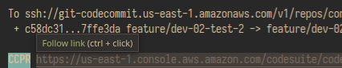

# ccpr

CodeCommit Pull Request URL hook



## Installation

```bash
sudo npm install -g .
```

## Usage

```
Usage: git push -u origin |& ccpr [options]

Options:
      --version  Show version number                                   [boolean]
  -b, --branch   Target branch                                          [string]
  -o, --open     Open url in the browser                               [boolean]
  -h, --help     Show help                                             [boolean]
```

## Examples

```bash
git push -u origin feature/super-feature |& ccpr -b=dev -o
git push -f origin |& ccpr
```

## Contributing

Pull requests are welcome. For major changes, please open an issue first to discuss what you would like to change.

Please make sure to update tests as appropriate.

## License

[MIT](https://choosealicense.com/licenses/mit/)
